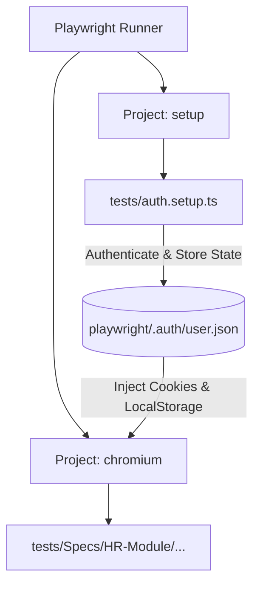

# Playwright Session Authentication & Session Sharing Guide

This guide describes the design, implementation, and utilization of the saved login session framework in Playwright.

> [!NOTE]
> By caching the authentication state (`cookies` and `localStorage`), you skip the repetitive username/password login steps for all tests, saving significant execution time and completely avoiding concurrency conflicts on the server.

---

## 🛠️ Architecture Overview

The authentication state caching is implemented using Playwright's native **Project Dependencies** framework. 



1. **Authentication Hook (`auth.setup.ts`)**: Runs a single time prior to any functional tests. It types the credentials, selects the corporate `V Cola Z`, waits for the dashboard to settle, and serializes the state to `playwright/.auth/user.json`.
2. **Global Integration (`playwright.config.ts`)**: All tests running under the `chromium` project automatically load the `playwright/.auth/user.json` storage state upon startup.
3. **Single Page Application Auto-Redirect**: The web application's client-side router detects the active session and corporate ID in the loaded `localStorage` and automatically performs a client-side redirect to the `/choose-module` screen.

---

## 📂 File Modifications Reference

### 1. The Global Setup Script
Located at [tests/auth.setup.ts](file:///d:/Noqood/mohamed/tests/auth.setup.ts). It logs in and caches the state:
```typescript
import { test as setup } from '@playwright/test';
import { LoginPage } from './Pages/login/loginPage';

const authFile = 'playwright/.auth/user.json';

setup('authenticate', async ({ page }) => {
  const loginPage = new LoginPage(page);
  await loginPage.goto();
  await loginPage.login('admin@zeta.com', 'P@ssw0rd');
  await loginPage.verifyLoginSuccessWithCorporate();

  // Ensure dashboard is fully loaded and session tokens are completely saved
  await page.getByText('Human Resources').first().waitFor({ state: 'visible', timeout: 30000 });
  await page.waitForTimeout(2000); // Safe settle timeout

  // Save the browser's storage state (cookies, localStorage, etc.)
  await page.context().storageState({ path: authFile });
});
```

### 2. Configuration Settings
Defined in [playwright.config.ts](file:///d:/Noqood/mohamed/playwright.config.ts):
```typescript
projects: [
  // Setup project that runs first
  {
    name: 'setup',
    testMatch: /.*\.setup\.ts/,
  },
  // Main test project dependent on the setup
  {
    name: 'chromium',
    use: {
      ...devices['Desktop Chrome'],
      // Use prepared auth state.
      storageState: 'playwright/.auth/user.json',
    },
    dependencies: ['setup'],
  },
]
```

---

## ⚡ How to Adapt Your Test Specs ("Before" vs "After")

Here is how we optimized [manageEmployees.spec.ts](file:///d:/Noqood/mohamed/tests/Specs/HR-Module/Personal/Employees/manageEmployees.spec.ts) to run fast:

### Before 🐢 (Manual login per spec)
```typescript
import { test } from '@playwright/test';

test.beforeEach(async ({ page }) => {
  loginPage = new LoginPage(page);
  manageEmployeesPage = new ManageEmployeesPage(page);

  await test.step('Login and Navigate to Employees', async () => {
    await loginPage.goto();
    await loginPage.login('admin@zeta.com', 'P@ssw0rd');
    await loginPage.verifyLoginSuccessWithCorporate();
    await manageEmployeesPage.navigateToEmployees();
  });
});
```

### After 🚀 (Bypassing login)
```typescript
import { test, expect } from '@playwright/test';

test.beforeEach(async ({ page }) => {
  loginPage = new LoginPage(page);
  manageEmployeesPage = new ManageEmployeesPage(page);

  await test.step('Navigate to Employees using saved session', async () => {
    // 1. Load base page
    await loginPage.goto();

    // 2. Wait for the SPA to automatically redirect to the module selection page
    await page.waitForURL(/choose-module/, { timeout: 30000 });

    // 3. Navigate directly to employees (clicks the Human Resources card from /choose-module)
    await manageEmployeesPage.navigateToEmployees();
  });
});
```

---

## 🚀 Execution Commands

To execute tests and leverage the cached storage state, run:

```bash
# Run all tests (automatically executes the setup if auth file is missing or needs refresh)
npx playwright test --project=chromium

# Run a specific spec file
npx playwright test tests/Specs/HR-Module/Personal/Employees/manageEmployees.spec.ts --project=chromium

# Manually trigger just the setup project to refresh the stored session
npx playwright test --project=setup
```

> [!TIP]
> The generated session file `playwright/.auth/user.json` is automatically ignored from Git by `.gitignore`, ensuring your secrets and session IDs remain secure locally.
